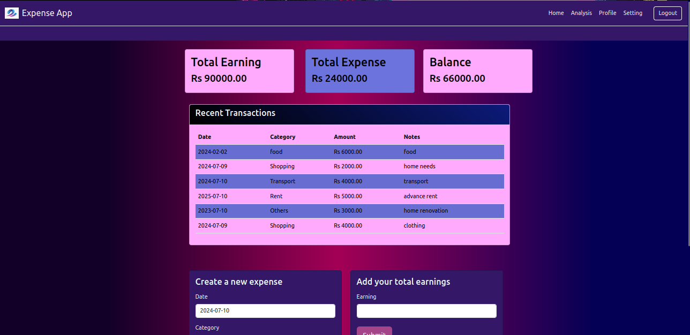
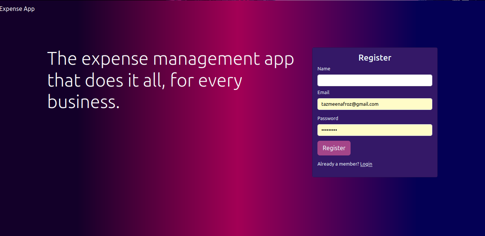
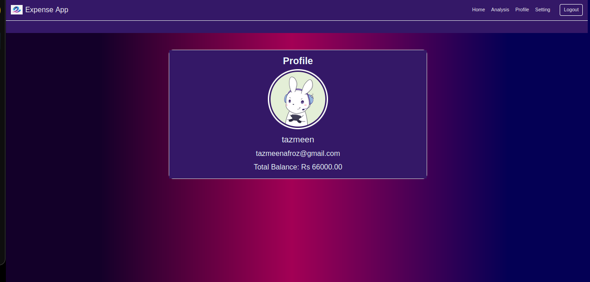
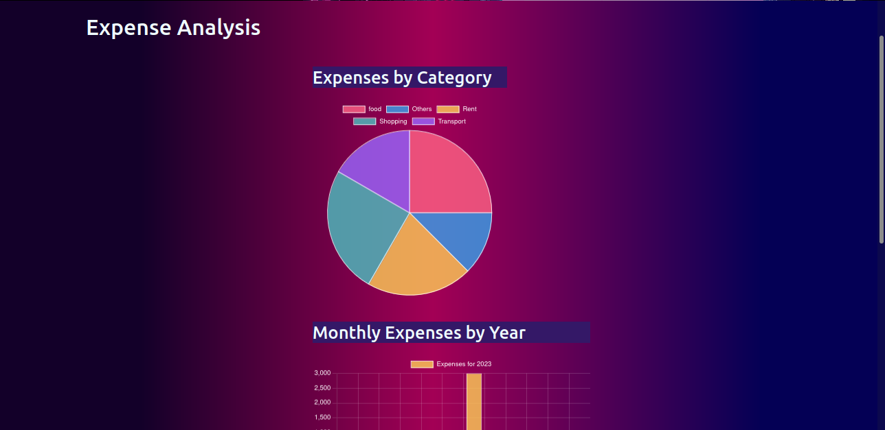

<body>
    

        <h1>Flask Expense App</h1>
        <h2>Overview</h2>
      
Flask Expense App is a web-based application that helps users track their expenses and earnings. The app allows users to add, view, and manage their expenses, providing insights through a user-friendly interface. It includes features like user authentication, expense categorization, and financial analysis.

       <h2>Features</h2>
        <ul>
            <li><strong>User Authentication</strong>: Register and login functionality with secure session management.</li>
            <li><strong>Expense Management</strong>: Add, view, and delete expenses with categories like Food, Transport, Shopping, Rent, and Others.</li>
            <li><strong>Earnings Management</strong>: Add and track earnings to manage your finances.</li>
            <li><strong>Financial Analysis</strong>: Visualize your expenses and earnings through various graphs and charts.</li>
            <li><strong>User Profile</strong>: View and update user profile settings.</li>
        </ul>
       <h2>Technologies Used</h2>
        <ul>
            <li><strong>Flask</strong>: Web framework used to build the application.</li>
            <li><strong>MySQL</strong>: Database for storing user data, expenses, and earnings.</li>
            <li><strong>HTML/CSS/JS</strong>: Frontend technologies to create a responsive and user-friendly interface.</li>
            <li><strong>Flask-WTF</strong>: Flask extension for handling forms and CSRF protection.</li>
        </ul>
      <h2>Installation</h2>
        <ol>
            <li>
                <strong>Clone the repository:</strong>
                <pre><code>git clone https://github.com/yourusername/Expense-App.git
cd flask-expense-app</code></pre>
            </li>
            <li>
                <strong>Install the dependencies:</strong>
                <pre><code>pip install -r requirements.txt</code></pre>
            </li>
            <li>
                <strong>Configure the database:</strong>
                
Ensure you have MySQL installed and create a database named <code>expense_DB</code>. Update the database configuration in <code>main.py</code>:

                <pre><code>conn = mysql.connector.connect(
    host="localhost",
    user="yourusername",
    password="yourpassword",
    database="expense_DB"
)</code></pre>
            </li>
            <li>
                <strong>Run the application:</strong>
                <pre><code>python3 main.py</code></pre>
                
The application will be available at <code>http://127.0.0.1:5000/</code>.

            </li>
        </ol>
    <h2>Usage</h2>
        <ol>
            <li><strong>Register</strong>: Create a new account by providing your name, email, and password.</li>
            <li><strong>Login</strong>: Log in to your account using the registered email and password.</li>
            <li><strong>Home</strong>: View the dashboard displaying total earnings, total expenses, and the balance.</li>
            <li><strong>Add Expense</strong>: Add new expenses by selecting a category, entering the amount, and providing additional notes.</li>
            <li><strong>Add Earning</strong>: Add your earnings to keep track of your total income.</li>
            <li><strong>Profile</strong>: View and update your profile information.</li>
            <li><strong>Analysis</strong>: Get insights into your spending habits through various charts and graphs.</li>
            <li><strong>Settings</strong>: Update your account settings such as name, email, and password.</li>
            <li><strong>Logout</strong>: Securely log out from your account.</li>
        </ol>
     <h2>File Structure</h2>
        <pre><code>expense_app/
├── main.py
├── requirements.txt
├── templates/
│   ├── home.html
│   ├── login.html
│   ├── register.html
│   ├── settings.html
│   ├── profile.html
│   └── analysis.html
├── static/
│   ├── css/
│   ├── js/
│   └── avatars/
├── database/
│   ├── expense_DB.sql
│   
└── README.md
</code></pre>
   <h2>Screenshots</h2>
        

            <h3>Home Page</h3>
            
            <h3>Register Page/h3>
            
            <h3>Profile</h3>
            
            <h3>Analysis</h3>
            
        

     <h2>Contributing</h2>
        <ol>
            <li>Fork the repository.</li>
            <li>Create a new branch (<code>git checkout -b feature-branch</code>).</li>
            <li>Make your changes and commit them (<code>git commit -m 'Add new feature'</code>).</li>
            <li>Push to the branch (<code>git push origin feature-branch</code>).</li>
            <li>Open a pull request.</li>
        </ol>
    <h2>License</h2>
        
This project is licensed under the MIT License.

    

</body>
</html>
